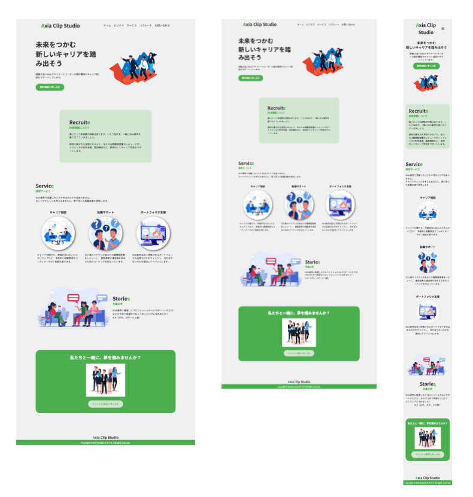

# ポートフォリオサイト

こちらは Web 業界・転職サポート LP のポートフォリオです。

## 技術スタック

- HTML5
- CSS3
- Normalize.css
- Font Awesome
- JavaScript (ES6+)
- Flexbox
- CSS Grid

## デモ

[デモサイトのリンク](https://axiaclip-dev.github.io/service-lp-demo/)

### スナップショット

#### 左: PC 版 | 中央：タブレット版 | 右: スマホ版



## 機能

- スタイリッシュな背景カラーのグラデーションを使用したデザイン
- レスポンシブデザインで、PC、タブレット、スマートフォンに最適化
- セクションごとのアニメーション効果によるユーザー体験の向上
- JavaScrip でハンバーガーメニューを実装

## ディレクトリ構成

```bash
service-lp-demo/
  |- images/
  |- css/
  |- js/
  |- index.html
  |- .gitignore
  |- README.md
```

## インストール

1. リポジトリをクローンします。

```bash
git clone https://github.com/axiaclip-dev/service-lp-demo.git
```

## 著作権

ソースコード、ロゴ、ファビコンの著作権は Axia Clip にあります。

### 画像の著作権

画像は Free 画像を使用しています。クレジットは以下の通りです。

```bash
- hero: Photo by [freepik](https://www.freepik.com/free-vector/isometric-finance-leaders-concept_19962867.htm#fromView=search&page=1&position=12&uuid=d258333d-edcc-4052-8cb6-96d80cfab78f)
- career: Photo by [freepik](https://www.freepik.com/free-vector/professional-consulting-service-research-recommendation-idea-strategy-management-troubleshooting-help-clients-with-business-problems-isolated-flat-vector-illustration_26477257.htm)
- support: Photo by [freepik](https://www.freepik.com/free-vector/organic-flat-people-asking-questions_13186454.htm#fromView=search&page=1&position=26&uuid=b98a5c6c-7ff5-4f51-a435-c1d542ab32c1)
- cording: Photo by [freepik](https://img.freepik.com/free-vector/web-developers-courses-computer-programming-web-design-script-coding-study-computer-science-student-learning-interface-structure-components_335657-2542.jpg?t=st=17285ba125~exp=1728575725~hmac=16c7b90597892765745e729e6653523b412f37b4a9e3a11ebbeb36f8affa1edf&w=740)
- stories: Photo by [freepik](https://www.freepik.com/free-vector/people-talking-arguing_9176206.htm#fromView=search&page=1&position=0&uuid=00510874-df12-42fd-97b1-2b0beb2e35f7)
- banner: Photo by [freepik](https://img.freepik.com/free-vector/group-business-people-avatar-character_24877-57314.jpg?t=st=1728572462~exp=1728576062~hmac=e52a939f251e5d4441904991b27653178f18abcd2e7d329aaa2d92fa1c1bf44c&w=826)
```
